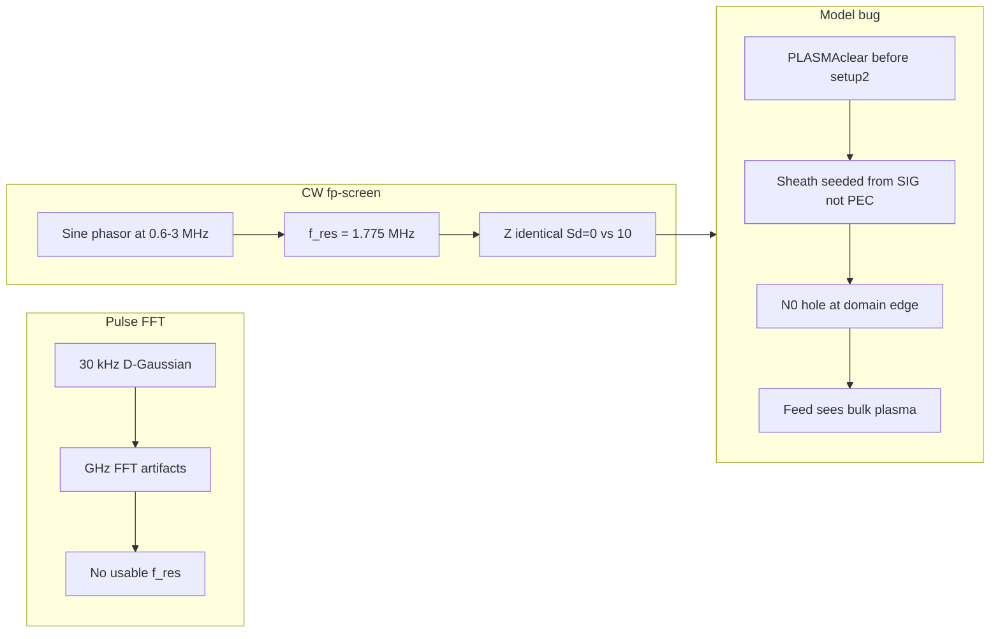
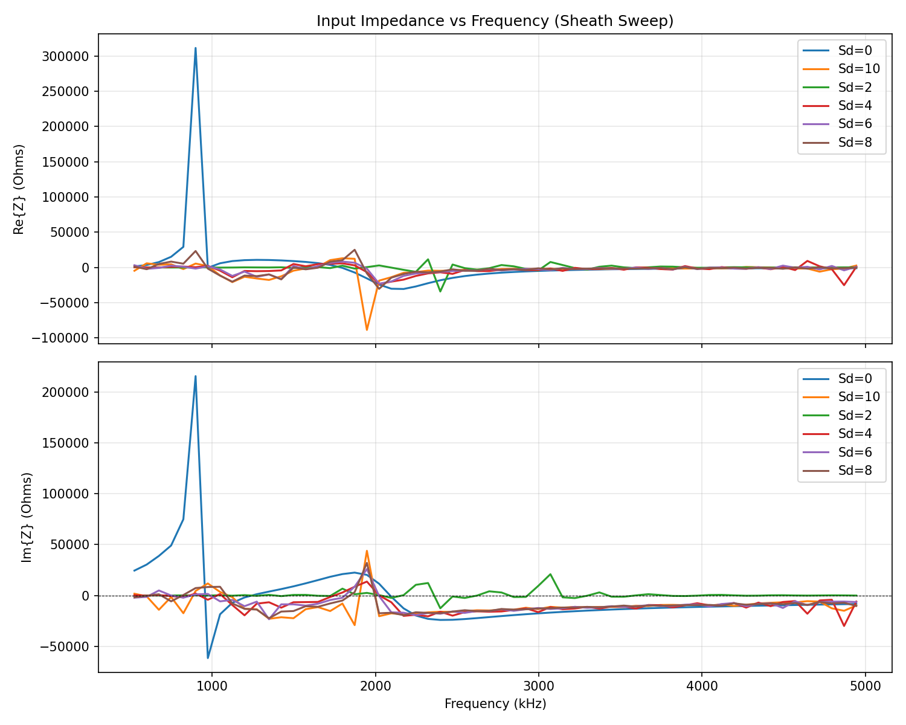
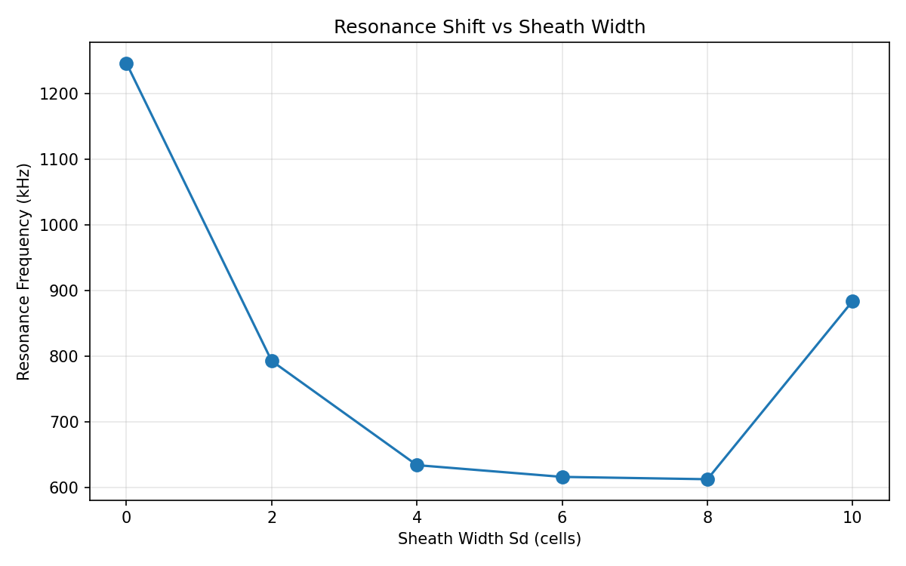
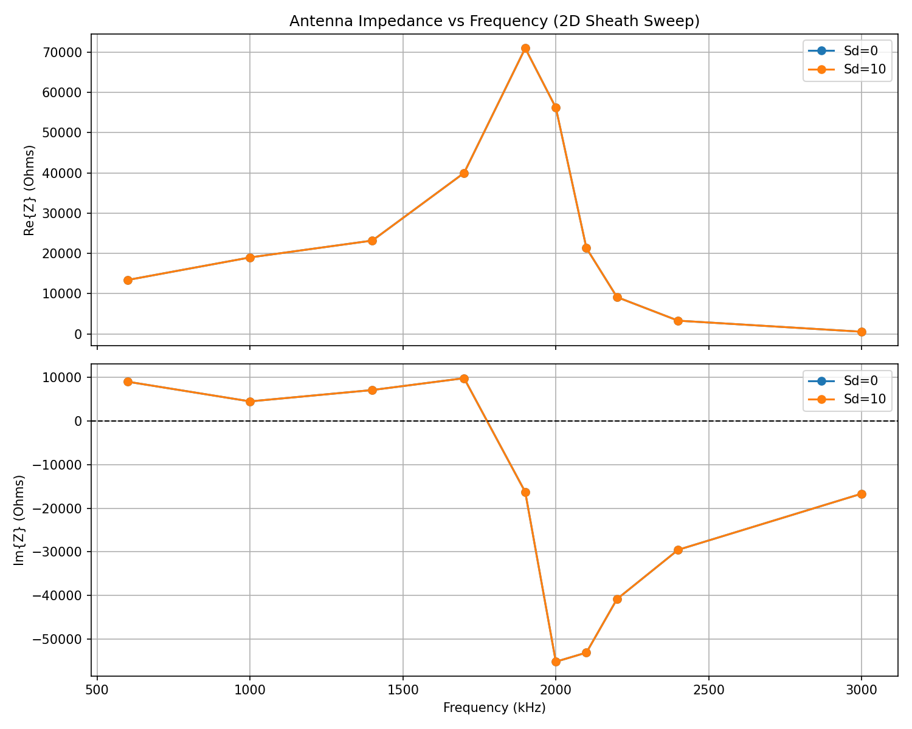
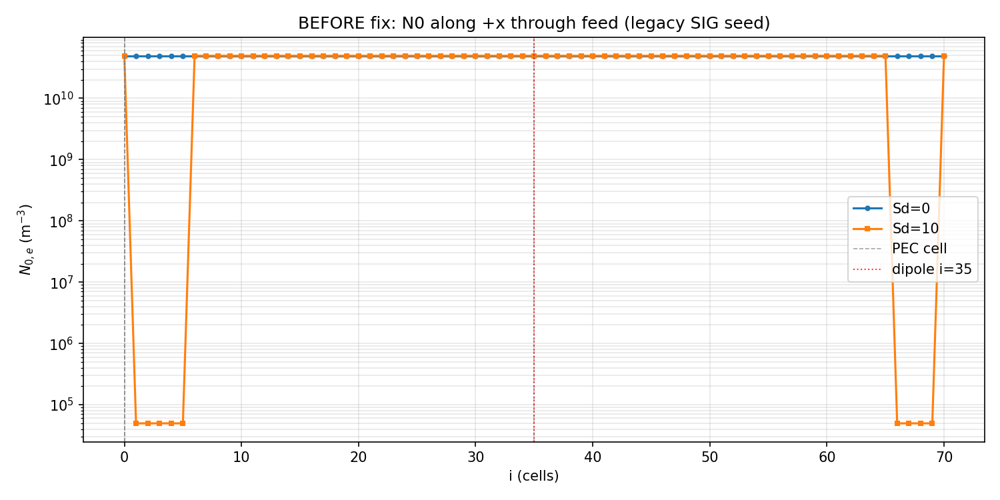
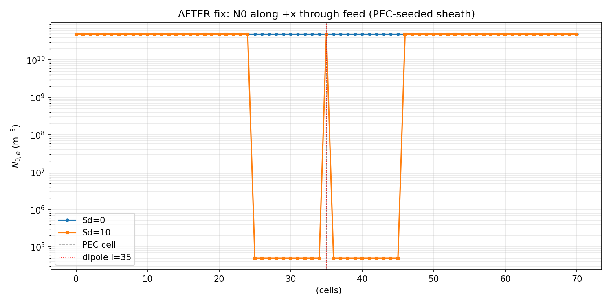
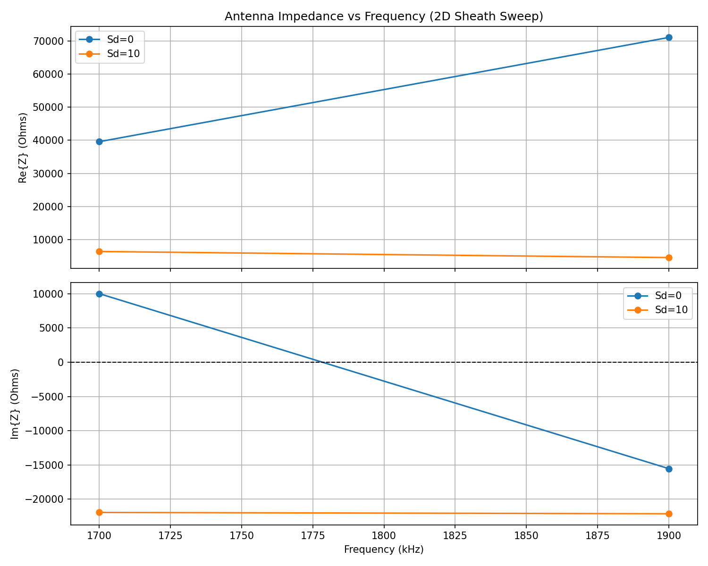

# Sheath Coupling Findings: Why Pulse and CW Sweeps Missed Tu (2008)

**Date:** 2026-08-12  
**Branch context:** sheath validation (`PffdtdSheath` / current worktree)  
**Primary data:** `results/sheath_fp_screen/`, `results/sheath_sweep/`, root FFT plots

This note records what the sheath-width campaigns measured, why those measurements did not show the expected resonance shift, and how the sheath–impedance coupling bug was diagnosed and fixed.

---

## 1. Expected physics (Tu 2008)

A conducting antenna in plasma develops a vacuum (or strongly depleted) sheath of width \(S_d\) cells next to the conductor. Inside that layer the ambient density is essentially zero; outside it recovers to the bulk \(N_0\).

Increasing \(S_d\) **reduces dielectric loading** near the antenna, so the series resonance frequency \(f_\mathrm{res}\) (Im\(\{Z\}=0\) crossing) should move **upward** toward the free-space value.

An equivalent-circuit picture of the same effect is a sheath capacitance in series with the antenna feed:

\[
Z_\mathrm{in}(f) = Z_\mathrm{ant}(f) + \frac{1}{j\omega C_\mathrm{sh}},
\qquad
C_\mathrm{sh} \sim \frac{\varepsilon_0 A}{S_d\,\Delta x}.
\]

In FDTD this is realized by a **volumetric vacuum gap** on the Yee nodes adjacent to the conductor: depleted \(N_0\) \(\Rightarrow\) plasma current \(J\approx 0\) \(\Rightarrow\) those cells act as vacuum capacitors loading the feed. Tu’s lumped \(C_\mathrm{sh}\) is the circuit limit of that gap; it was **not** implemented as a separate circuit element in the solver.

---

## 2. Two different failures

### 2.1 Pulse sweeps failed as a measurement

| Item | Value |
|------|-------|
| Driver | `scripts/run_sheath_sweep.ps1` |
| Input | `sheath.str` — source type 5 (differentiated Gaussian), 30 kHz |
| Plasma | \(f_p = 200\,\mathrm{kHz}\), \(T=2000\,\mathrm{K}\) |
| Sheath | \(S_d = 0,2,4,6,8,10\) |
| Analysis | Hanning-window FFT of full \(V(t)/I(t)\) (`scripts/analyze_sheath_results.py`) |

**Result:** no Im\(\{Z\}=0\) crossing below 1 MHz. Fallback \(|Z|\) peaks fell in the multi-GHz band and are sampling/FFT artifacts, not the kHz/MHz antenna resonance. See historical writeup in [`docs/sheath/SHEATH_VALIDATION_ANALYSIS.md`](../docs/sheath/SHEATH_VALIDATION_ANALYSIS.md) and figures:

That campaign **cannot test** Tu (2008): the observable (\(f_\mathrm{res}\)) was never resolved.

### 2.2 CW fp-screen succeeded as a measurement and failed as physics

| Item | Value |
|------|-------|
| Driver | `scripts/run_sheath_fp_screen_parallel.ps1` |
| Input | `sheath_sine.str` — CW sine, frequency patched per run |
| Plasma | \(f_p = 2\,\mathrm{MHz}\) |
| Sheath | \(S_d = 0\) and \(S_d = 10\) only |
| Frequencies | 0.6, 1.0, 1.4, 1.7, 1.9, 2.0, 2.1, 2.2, 2.4, 3.0 MHz |
| Analysis | Steady-state phasor \(Z = V/I\) on last 50% of trace (`scripts/analyze_2d_sweep.py`) |

**Result:** clean series resonance at **\(\approx 1.775\,\mathrm{MHz}\)** for **both** \(S_d=0\) and \(S_d=10\). Impedance agrees to **\(\sim 0.003\%\)**:

| \(f\) (MHz) | Re\(Z\) Sd=0 | Re\(Z\) Sd=10 | Im\(Z\) Sd=0 | Im\(Z\) Sd=10 |
|---:|---:|---:|---:|---:|
| 0.60 | 13414.2 | 13413.9 | +9035.6 | +9035.4 |
| 1.00 | 19010.1 | 19009.5 | +4516.7 | +4517.0 |
| 1.40 | 23192.8 | 23193.0 | +7124.8 | +7125.1 |
| 1.70 | 39980.4 | 39980.9 | +9845.3 | +9845.2 |
| 1.90 | 70942.1 | 70942.3 | −16284.5 | −16284.7 |
| 2.00 | 56193.4 | 56193.0 | −55242.0 | −55242.7 |
| 2.10 | 21336.2 | 21336.4 | −53151.9 | −53151.6 |
| 2.20 | 9163.7 | 9163.6 | −40864.8 | −40864.8 |
| 2.40 | 3312.4 | 3312.5 | −29552.6 | −29552.6 |
| 3.00 | 566.8 | 566.9 | −16669.6 | −16669.6 |

Raw tables: [`data/summary_sd0.txt`](data/summary_sd0.txt), [`data/summary_sd10.txt`](data/summary_sd10.txt).

Tu requires an **upward** shift of \(f_\mathrm{res}\) with sheath width. Identical \(Z(f)\) means the sheath **never enters the feed**.

Earlier CW work (2D sweep at 100–300 kHz, narrow-band below \(f_p\)) either lacked an Sd comparison or sat far below the resonance band; the fp-screen is the definitive negative physics result.

---

## 3. How sheath was supposed to enter the model

Active path: [`src/physics/plasma.cpp`](../src/physics/plasma.cpp).

1. Initialize `N0_SPATIAL` to uniform bulk \(N_0\).
2. Set `SIG=1` where plasma couples into Maxwell (`Ecalcmod`: \(-C_\mu\,\mathrm{SIG}\,J\)).
3. If \(S_d>0\), dilate a distance field from a seed and set
   \[
   N_{0,\mathrm{spatial}} = N_0\cdot N_\mathrm{MIN\_RATIO}
   \quad (N_\mathrm{MIN\_RATIO}=10^{-6})
   \]
   for \(0 < d \le S_d\).
4. Fluid updates (`Ucalc`/`Ncalc`) and current \(J\) use `N0_SPATIAL`. Depleted cells \(\Rightarrow\) \(J\approx 0\).

Feed observables ([`src/source/source.cpp`](../src/source/source.cpp)):

- Hard \(E_z\) voltage source at dipole center \((35,35,33)\).
- \(V = -E_z\,\Delta z\), \(I\) from Ampère loop of \(B_x,B_y\) around that cell.
- Plasma loading of \(Z\) therefore requires depleted / vacuum response in **near-antenna** Yee nodes that enter that loop—not at the outer domain wall.

---

## 4. Why \(Z\) did not see \(S_d\) (code)

Three overlapping mistakes:

### 4.1 Init order

[`src/pffdtd.cpp`](../src/pffdtd.cpp) called `PLASMAclear()` **before** `setup2()`. At that moment `ClearArrays()` had set `ERX=ERY=ERZ=1` everywhere. The “mark antenna / turn plasma on” loop therefore set `SIG=1` on the **entire interior plasma box** \((i,j,k)\in[6,s_x-4)\), not on the dipole.

### 4.2 Wrong sheath seed

Sheath dilation seeded from `SIG > 0.5`. Even after reordering geometry, `SIG=1` was defined where *any* of `ERX/ERY/ERZ == 1`. The thin-wire dipole in [`sheath.str`](../sheath.str) is only `ERZ=0` at \((35,35,20\text{–}45)\); `ERX` and `ERY` stay 1. So `SIG` is a **plasma-on mask**, not a conductor mask. Distance \(d=0\) filled the whole interior; depletion landed in an \(S_d\)-cell shell at the **domain boundary** (\(\sim 0.4\,\mathrm{m}\) for \(S_d=10\), \(\Delta x=0.04\,\mathrm{m}\)), while the dipole sits at the grid center.

### 4.3 Feed never used those cells

Near-antenna nodes kept bulk \(N_0\). \(V\) and \(I\) at the hard source therefore saw the same plasma loading for every \(S_d\). Additionally, `NBCcalc` treated `SIG>0.5` as an “antenna sink” and clamped density **everywhere** in the plasma box—another symptom of overloaded `SIG` meaning.

`SIG` was used as (a) plasma–Maxwell coupling, (b) sheath seed, and (c) antenna sink. Those three meanings conflict.

Tu’s series-\(C\) picture was never implemented as a lumped element; the only sheath mechanism was `N0_SPATIAL` depletion, and that depletion was applied in the wrong place.

---

## 5. Diagnostic: \(N_0\) along a line normal to the dipole

Dump `N0_SPATIAL` (electrons) along \(i=0\ldots s_x\) at \(j=35\), \(k=33\) (feed plane, \(+x\) normal to the \(z\)-dipole), for \(S_d=0\) vs \(S_d=10\).

**Before the coupling fix** (confirmed with legacy SIG-seeded binary):

- Both runs show bulk \(N_0 = 4.96\times10^{10}\,\mathrm{m}^{-3}\) next to the wire (\(i\approx 35\)).
- For \(S_d=10\), depletion to \(N_0\times10^{-6}\) appears only near the domain edge (\(i=1\ldots5\)), outside the plasma box.
- Smoking gun: a density hole exists, but the feed does not use those cells—so \(Z\) stays identical.

**After the coupling fix** (confirmed):

- Sheath seeds from **26** dipole PEC cells (not ~14k false boundary PECs).
- \(S_d=0\): uniform bulk along the line.
- \(S_d=10\): depletion for \(0 < |i-35| \le 10\); domain edge remains bulk.
- Near-wire median \(N_0\): \(4.96\times10^{10}\) (Sd=0) vs \(4.96\times10^{4}\) (Sd=10).

Data dumps: [`data/n0_line_before_sd0.dat`](data/n0_line_before_sd0.dat), [`data/n0_line_before_sd10.dat`](data/n0_line_before_sd10.dat), [`data/n0_line_after_sd0.dat`](data/n0_line_after_sd0.dat), [`data/n0_line_after_sd10.dat`](data/n0_line_after_sd10.dat).

---

## 6. Coupling fix (what changed)

Implemented volumetric vacuum sheath on **conductor-adjacent** Yee nodes (FDTD form of depleted density + Tu series-\(C\) loading):

1. **Reorder init** in `pffdtd.cpp`: `ClearArrays` → `setup2` (antenna `ER*`) → `PLASMAclear` → `ApplySheath` → `DumpN0Line` → `Ninital`.
2. **Seed sheath from PEC**, not `SIG`: cells with `ERX==0 || ERY==0 || ERZ==0`.
3. Keep **`SIG=1` as plasma–Maxwell coupling** (including sheath cells). With depleted `N0`, \(J\approx 0\), so those cells act as vacuum.
4. Restrict **`NBCcalc` sink to PEC cells only** (same `ER*==0` test).
5. **`ClearArrays` now initializes the full `0..sx` index range** so uncleared `i/j/k=0` faces do not look like PEC and falsely seed the sheath (~14k bogus seeds → 26 real dipole cells).
6. CLI `MaxIter` (`argv[11]`) is re-applied **after** `setup1` reads the `.str` Fail Safe line (previously ignored).
7. Path buffers enlarged (`filein`/`fileout` and `openfile` temps) so long `results/...` paths do not overflow.

`ApplySheath()` owns the dilation / step-profile logic; it runs only after geometry exists. Legacy SIG-seeded dumps can be reproduced by compiling with `-DSHEATH_LEGACY_SIG_SEED=1`.

---

## 7. Post-fix confirmation

Short CW check at the resonance shoulder (1.7 MHz and 1.9 MHz, \(S_d=0\) vs \(S_d=10\), \(f_p=2\,\mathrm{MHz}\), MaxIter=100000):

| \(f\) (MHz) | Re\(Z\) Sd=0 | Re\(Z\) Sd=10 | Im\(Z\) Sd=0 | Im\(Z\) Sd=10 | \(\|\Delta Z\|/\|Z_0\|\) |
|---:|---:|---:|---:|---:|---:|
| 1.70 | 39564 | 6406 | +10023 | **−21936** | **112.8%** |
| 1.90 | 71059 | 4573 | −15542 | −22129 | **91.9%** |

Pre-fix fp-screen at the same frequencies differed by \(\sim 0.003\%\). After the fix, impedance depends strongly on sheath width.

- Sd=0 still shows an Im\(\{Z\}\) sign change between 1.7 and 1.9 MHz (\(f_\mathrm{res}\sim 1.78\,\mathrm{MHz}\)).
- Sd=10 is strongly capacitive at both points — the feed now sees the vacuum sheath. Locating the new \(f_\mathrm{res}\) for a full Tu shift curve needs a denser CW sweep; the coupling bug itself is resolved.

Numeric table: [`data/confirm_z_summary.txt`](data/confirm_z_summary.txt). Raw runs: `results/sheath_confirm_z/`.

---

## 8. Post-fix long pulse FFT (2026-08-13)

Full Sd grid after the coupling fix (`results/sheath_pulse_long/`, MaxIter=2e5, Spar=2 MHz, \(f_p=2\,\mathrm{MHz}\), VcRate=50):

| Sd | \(f_\mathrm{res}\) (MHz) Im +→− in 1.2–3 MHz | Im\{Z\} @ 1.7 MHz | Im\{Z\} @ 1.9 MHz |
|---:|---:|---:|---:|
| 0 | 2.09 | +18325 | +22444 |
| 2 | 1.23 (noisy; also 2.03) | −536 | +1115 |
| 4 | 2.02 | −1542 | +8541 |
| 6 | 2.02 | −4527 | +8638 |
| 8 | 2.00 | −7910 | +3205 |
| 10 | 2.00 | **−15393** | **−29243** |

Plots: [`figures/pulse_long_impedance.png`](figures/pulse_long_impedance.png), [`figures/pulse_long_resonance_shift.png`](figures/pulse_long_resonance_shift.png). Summary: [`data/pulse_long_resonance_summary.txt`](data/pulse_long_resonance_summary.txt).

**Takeaways:** Pulse FFT now **sees Sd** (curves separate; Sd=10 is capacitive through 1.7–1.9 MHz, matching CW confirm). Automatic −→+ resonance picks from the stock analyzer are often spurious at lower \(f\); CW-compatible +→− crossings near ~2 MHz are more stable for Sd≥4. Frequency resolution is coarse (\(df\sim 75\,\mathrm{kHz}\)); a denser CW sweep remains better for a clean Tu \(f_\mathrm{res}(S_d)\) curve.

---

## 9. File map

| Path | Role |
|------|------|
| `analysis/sheath_coupling_findings.md` | This document |
| `analysis/figures/` | Supporting plots |
| `analysis/data/` | Numeric tables and N0 dumps |
| `docs/sheath/SHEATH_VALIDATION_ANALYSIS.md` | Earlier pulse-FFT post-mortem (points here) |
| `docs/sheath/SHEATH_VALIDATION_IMPLEMENTATION_PLAN.md` | Original Tu validation plan |
| `scripts/plot_n0_line.py` | Overlay Sd=0 vs Sd=10 N0 lines |
| `scripts/analyze_2d_sweep.py` | CW phasor impedance |
| `scripts/analyze_pulse_long.py` | Post-fix pulse FFT (CW-compatible crossings) |

---

## 10. Conclusion

- **Pulse + FFT (pre-fix):** measurement failure (no usable resonance) + sheath not coupled.
- **CW fp-screen (pre-fix):** measurement success, physics failure — \(Z(S_d=0)\equiv Z(S_d=10)\) to \(\sim 0.003\%\).
- **Root cause:** sheath seeded from the plasma-on mask before antenna geometry existed, so depletion sat at the domain boundary while the feed saw bulk plasma. A secondary ClearArrays bug also made domain faces look like PEC.
- **Fix:** seed sheath from PEC after `setup2`, keep `SIG` for coupling only, sink density only on PEC, initialize full ER arrays.
- **Verification:** N0 line dumps show depletion next to the wire for Sd=10; CW confirm runs show \(\|\Delta Z\|/\|Z\|\sim 90\text{–}110\%\) at 1.7/1.9 MHz (was 0.003%).
- **Post-fix pulse:** Sd dependence is visible in \(Z(f)\); use CW for precise \(f_\mathrm{res}\) vs Sd.
