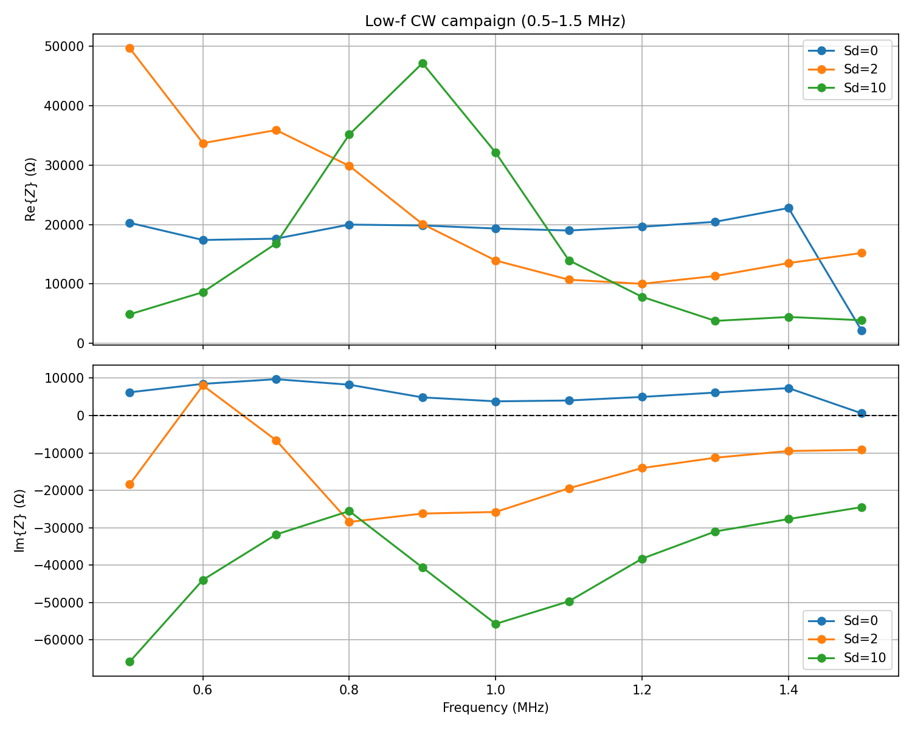
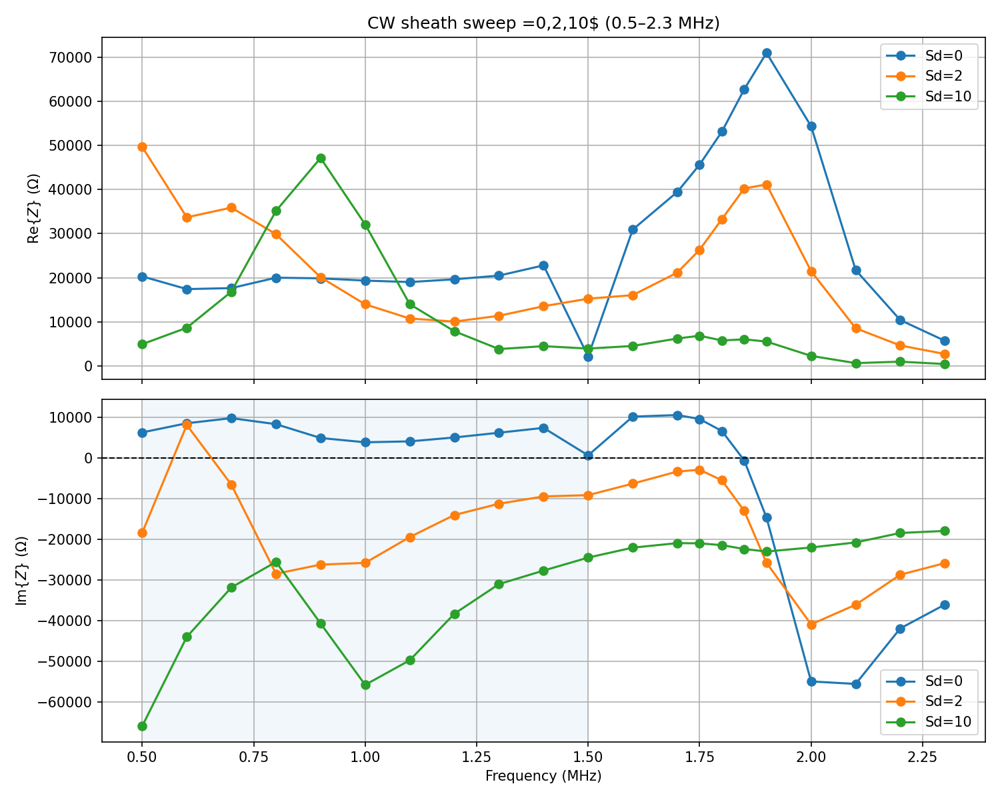
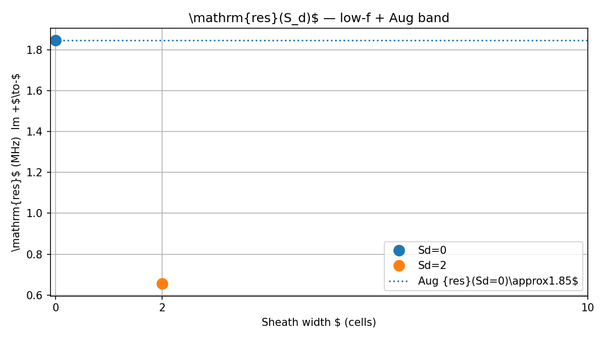

# Low-frequency CW analysis (0.5–1.5 MHz)

**Date:** 2026-09-04  
**Sweep:** `scripts/run_sheath_cw_lowf.ps1` — \(S_d\in\{0,2,10\}\), 11 tones, \(f_p=2\,\mathrm{MHz}\)  
**Wall time:** 52.85 h (30 completed + 3 skipped August cases at 1.50 MHz)  
**Method:** phasor \(Z=V/I\) on last 50% of `.vc` (same as August CW Tu)  
**Outputs:** `data/cw_lowf_*.txt`, `figures/cw_lowf_*.png` (this folder)  
**Report:** `validation/phase_7_documentation/` — Ch.~low-f (`08_lowf.tex`), Ch.~discrepancy (`09_discrepancy.tex`)
**Program:** Paper 0 archive — see `../../CHRONICLE.md`
## Status

All planned low-f cells finished. Combined with August high-band points for the same three \(S_d\), 63 phasors are available (0.5–2.3 MHz).

**Caveat:** `sd0_f1500000` is the incomplete August restart file (~340 kB, no `DONE` line). Its \(Z\) (Re≈2.1 kΩ) is an outlier vs 1.40 MHz (Re≈23 kΩ) and should not be used for physics. Use 1.40 MHz and August ≥1.60 MHz for the \(S_d=0\) branch.

## Impedance findings (0.5–1.5 MHz)

| \(S_d\) | Im\(\{Z\}\) in 0.5–1.5 MHz | \(f_\mathrm{res}\) (Im +→−) |
|--------:|----------------------------|-----------------------------|
| 0 | All **inductive** (Im > 0) | none in low-f; **1.846 MHz** from August band |
| 2 | Cap → ind at 0.60 → capacitive for \(f\ge 0.70\) | **0.655 MHz** (also −→+ at 0.570 MHz) |
| 10 | All **capacitive** (Im < 0) | none in band — at or **below 0.50 MHz** |

Curves remain well separated (\(|\Delta Z|/|Z_0|\) typically 80–350% vs \(S_d=0\)): sheath coupling is confirmed across the low-f band.

## Resonance vs Tu (2008)

| \(S_d\) | \(f_\mathrm{res}\) (MHz) | vs Tu upward-shift target |
|--------:|-------------------------:|---------------------------|
| 0 | 1.846 | baseline plasma-loaded resonance |
| 2 | 0.655 | **down** by ~1.2 MHz |
| 10 | ≤ 0.50 (or no clean +→−) | **further down / absent** |

Tu-inspired design target: \(f_\mathrm{res}\) rising with \(S_d\) toward free-space. Measured: wider sheath moves the zero-crossing **downward** (or removes it from 0.5–2.3 MHz). Full reasons (series \(C_\mathrm{sh}\), problem mismatch, marker/geometry): [`tu_discrepancy_discussion.md`](tu_discrepancy_discussion.md) and phase-7 Ch.~discrepancy.

## Sd=2 structure

Im signs over 0.5–1.5 MHz: `-+---------`

- Brief inductive island at **0.60 MHz** only  
- Series-like +→− crossing ≈ **0.655 MHz**  
- Capacitively dominated afterward through 1.5 MHz and the August band  

Treat 0.655 MHz as the best single +→− pick; the narrow −→+/+→− pair around 0.5–0.7 MHz may warrant denser tones if a precision \(f_\mathrm{res}(S_d=2)\) is needed.

## Conclusion

1. Low-f extension **succeeded as a measurement**: \(S_d>0\) features below 1.5 MHz are resolved.  
2. Open August hypothesis is **confirmed**: crossings for \(S_d\ge 2\) lie below 1.5 MHz (or the feed is uniformly capacitive).  
3. Campaign Tu-inspired upward \(f_\mathrm{res}(S_d)\) is **not reproduced** — consistent with series \(C_\mathrm{sh}\) domination.  
4. Phase-7 report now carries plots + discrepancy chapter; markdown detail: [`tu_discrepancy_discussion.md`](tu_discrepancy_discussion.md).  
5. Next physics step is model/metric choice (see also `docs/SHEATH_MODELS_LITERATURE_DISCUSSION.md`), not more of the same 100 kHz CW grid.
